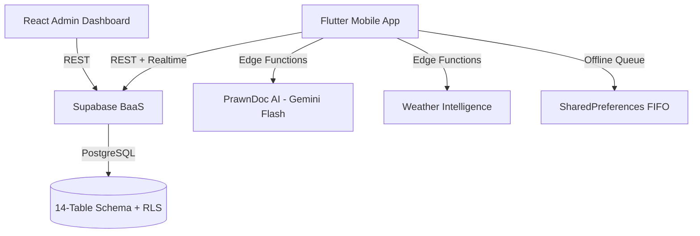

<div align="center">

# 🦐 PrawnGuard.ai

**Enterprise Aquaculture Intelligence & Finance Platform**

*SIH 2026 — Smart India Hackathon*

[](https://github.com/YOUR_USERNAME/sih_2026/actions/workflows/ci.yml)
[](https://flutter.dev)
[](https://react.dev)
[](https://supabase.com)

</div>

---

## 📋 Overview

PrawnGuard.ai is an offline-first mobile platform for shrimp farmers in Andhra Pradesh (Bhimavaram, Nellore, West Godavari). It provides AI-powered disease detection, intelligent feed management, real-time weather alerts, and financial tracking — all with bilingual Telugu/English support.

## 🏗️ Architecture



### Tech Stack

| Layer | Technology |
|---|---|
| Mobile App | Flutter 3.47 + Dart 3.13, Riverpod, GoRouter |
| Backend | Supabase (PostgreSQL + Auth + Edge Functions + Realtime) |
| AI Engine | Google Gemini Flash (Vision), Bio-energetics Feed AI |
| Admin Dashboard | React 19 + Vite 6 + Tailwind CSS 4 + Recharts |
| CI/CD | GitHub Actions (lint → test → build → release) |
| Containerization | Docker + nginx (admin dashboard) |

## 🚀 Quick Start

### Prerequisites

- [Flutter SDK](https://flutter.dev/docs/get-started/install) ≥ 3.2.0
- [Node.js](https://nodejs.org/) ≥ 20
- Java 17 (for Android builds)
- [Docker](https://www.docker.com/) (optional, for admin dashboard)

### 1. Clone & Setup

```bash
git clone https://github.com/YOUR_USERNAME/sih_2026.git
cd sih_2026
cp .env.example .env
# Edit .env with your Supabase URL, keys, etc.
```

### 2. Run the Mobile App

```bash
flutter pub get
flutter run --dart-define-from-file=.env
```

### 3. Run the Admin Dashboard

```bash
cd admin-dashboard
npm install
npm run dev
# Open http://localhost:5173
```

Or with Docker:

```bash
docker compose up admin-dashboard
# Open http://localhost:8080
```

### 4. Build Release APK

```powershell
# Windows (PowerShell)
.\scripts\build_release.ps1 -Target apk

# Or manually
flutter build apk --release --obfuscate --split-debug-info=build/symbols \
  --dart-define=SUPABASE_URL=your_url \
  --dart-define=SUPABASE_ANON_KEY=your_key \
  --dart-define=ENVIRONMENT=production
```

## 📁 Project Structure

```
sih_2026/
├── lib/
│   ├── main.dart                    # App entry point
│   ├── core/
│   │   ├── providers/               # Riverpod state management
│   │   ├── router/                  # GoRouter navigation
│   │   ├── services/                # Business logic services
│   │   └── theme/                   # Deep Ocean Matte design system
│   ├── features/
│   │   ├── auth/                    # Authentication
│   │   ├── home/                    # Dashboard home
│   │   ├── ponds/                   # Pond management
│   │   ├── feed/                    # Feed AI engine
│   │   ├── prawndoc/                # Disease detection AI
│   │   ├── finance/                 # PrawnCredit finance
│   │   ├── weather/                 # Weather intelligence
│   │   └── more/                    # Settings & profile
│   └── l10n/                        # en.json + te.json
├── admin-dashboard/                 # React admin portal
│   ├── Dockerfile                   # Production container
│   └── src/
├── supabase/
│   └── functions/                   # Edge Functions (Deno)
│       ├── prawndoc-ai/
│       └── weather-intelligence/
├── android/                         # Native Android config
├── test/                            # 281 unit tests (6 tiers)
├── scripts/
│   ├── build_release.ps1            # Release automation
│   ├── generate_keystore.ps1        # Keystore generator
│   └── pre_launch_checklist.ps1     # Pre-launch validator
├── .github/workflows/
│   ├── ci.yml                       # CI pipeline
│   └── release.yml                  # Release publisher
├── docker-compose.yml               # Admin dashboard container
├── .env.example                     # Environment template
└── pubspec.yaml
```

## 🧪 Testing

```bash
# Run all 281 tests
flutter test

# Run with coverage
flutter test --coverage

# Run specific tier
flutter test test/core/
flutter test test/e2e/
```

### Test Tiers

| Tier | Coverage |
|---|---|
| Tier 1 | Theme tokens & Deep Ocean Matte styling |
| Tier 2 | AuthService phone normalization |
| Tier 3 | OfflineSyncService FIFO queue |
| Tier 4 | AlertSystem thresholds, FeedAI splits |
| Tier 5 | TeluguVoiceNLU, GoRouter routing |
| Tier 6 | Concurrency, race conditions, caching |

## 🔐 Security

- **No hardcoded secrets** — all credentials via `--dart-define` at compile time
- **Network security config** — cleartext traffic blocked, certificate pinning
- **ProGuard/R8** — code obfuscation enabled for release builds
- **RLS policies** — Row Level Security on all Supabase tables
- **Backup disabled** — `android:allowBackup="false"`

## 📦 Deployment

### Mobile App (Play Store)
1. Generate release keystore: `./scripts/generate_keystore.ps1`
2. Configure `android/key.properties`
3. Build: `./scripts/build_release.ps1 -Target appbundle`
4. Upload AAB to Google Play Console

### Admin Dashboard (Docker)
```bash
docker compose up -d admin-dashboard
# Or deploy to Cloud Run:
gcloud run deploy prawnguard-admin \
  --source=admin-dashboard \
  --port=8080 \
  --allow-unauthenticated
```

## 🌍 Localization

Bilingual support for English and Telugu:
- `lib/l10n/en.json` — English strings
- `lib/l10n/te.json` — Telugu strings
- Runtime language switcher in Settings

## 📄 License

Built for Smart India Hackathon 2026.
